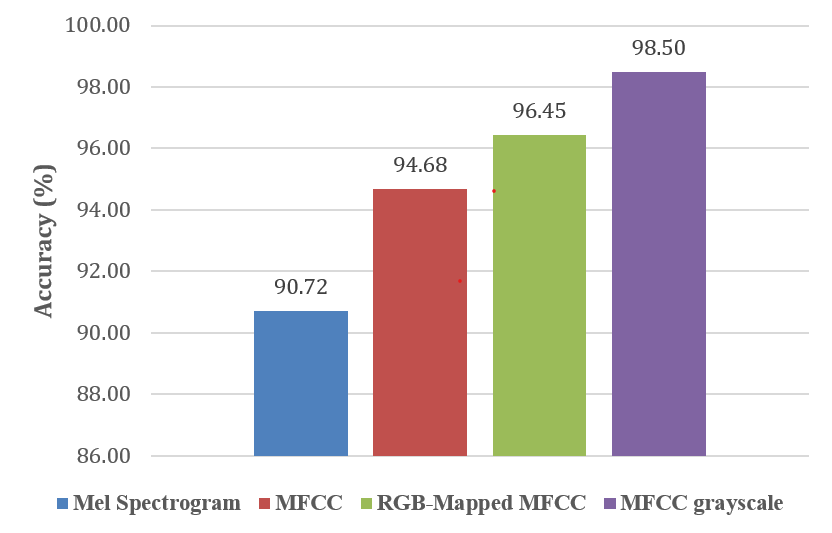
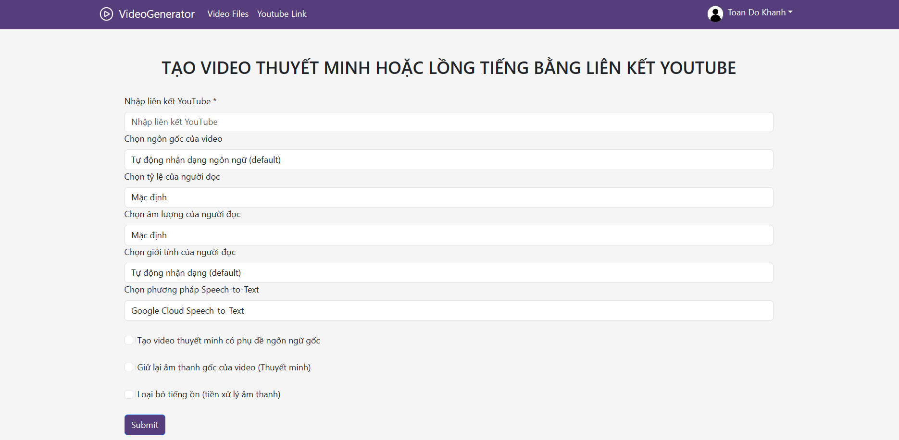
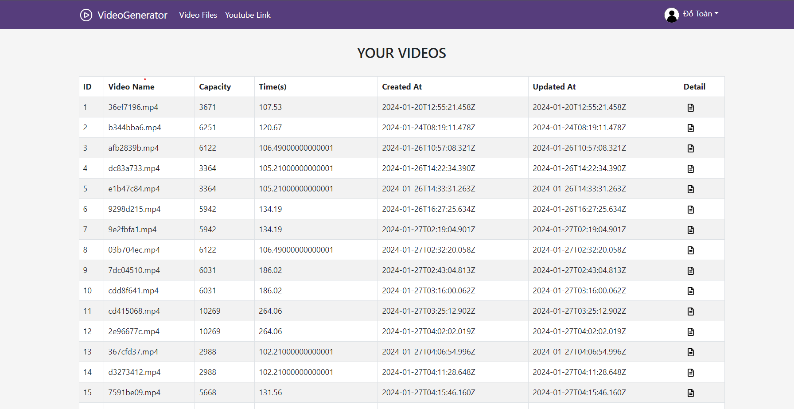

<h6 align="left">Author: <a href="https://github.com/toandokhanh">Do Khanh Toan<a/> </h6>

## Generating Dubbed and narrated videos based on speakers’ gender identification using deep learning techniques

## Introduction
The purpose of the project is to create high quality, highly accurate Vietnamese dubbed or dubbed videos with high subtitle and gender classification models while meeting diverse user needs.

## How well does it work?
.jpg)
Above is the application's workflow, it must operate through 4 main modules and the modules will depend on each other. The input will be a foreign language video, the output will be a Vietnamese video (with subtitles, dubbing, narrating, dubbing, and narrating subtitles)

#### Module 1

#### Module 2

#### Module 3

#### Module 4.1

#### Module 4.2

## Gender classification using deep learning methods
We propose a process. The first step is to apply audio preprocessing, which includes methods such as Noise Reduction, Audio Extraction, and Matched Audio Filtering. Next, we use the MFCC (Mel Frequency Cepstral Cofactors) image preprocessing method. Finally, the input data are fed into the VGG16 and ResNet34 gender classification models. The model is trained to predict gender based on the extracted audio features. The output of the model is a gender label, representing "male" or "female". This process integrates multiple information steps, helping us effectively extract audio features to achieve accurate results in gender classification.

.jpg)

#### MFCC preprocessing steps

## Results of gender classification model

#### Source of data sets
- AudioMNIST: Becker, S., Vielhaben, J., Ackermann, M., M ̈uller, K.-R., Lapuschkin, S., Samek, W.: Audiomnist:  xploring explainable artificial intelligence for audio analysis on a simple benchmark. Journal of the Franklin Institute
361(1), 418–428 (2024)
- TIMIT: Garofolo, J., Lamel, L., Fisher, W., Fiscus, J., Pallett, D., Dahlgren, N., Zue, V.: Timit acoustic-phonetic continuous speech corpus. Linguistic
Data Consortium (1992)
- RAVDESS: Livingstone, S.R., Russo, F.A.: The ryerson audio-visual database of emo-tional speech and song (ravdess): A dynamic, multimodal set of facial and vocal expressions in north american english. PLOS ONE 13(5), 0196391 (2018)
- CTU & COMMON: Nguyen, H.T., Thanh, T.N.L., Ngoc, T.L., Le, A.D., Tran, D.T.: Eval-uation on noise reduction in subtitle generator for videos. In: Innova-tive Mobile and Internet Services in Ubiquitous Computing, pp. 140–150. Springer (2022)

## User Interface Design

## Result Video
- [Original video](videos/45c723dd.mp4)
- [Video subtitles](videos/45c723dd_subtitle.mp4)
- [Video narrated](videos/45c723dd_audiodescribed.mp4)
- [Narrated video with original subtitles](videos/45c723dd_audiodescribed_explanation.mp4)
- [Video dubbed](videos/a81a62bf_audiodescribed.mp4)
- [dubbed video with original subtitles](videos/a81a62bf_audiodescribed_explanation.mp4)
## Demo
- Video dubbed: 

    

- Video narrated:

    

- Thesis defense (May 15, 2024):

    
